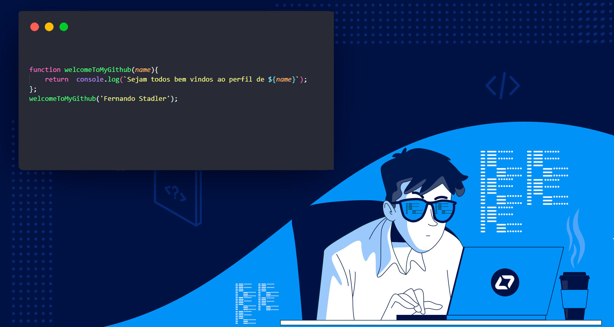

## Olá, me chamo Fernando Stadler, sejam todos bem vindos!

Graduado em Análise e Desenvolvimento de Sistemas pela Universidade Cruzeiro do Sul e atualmente estou cursando MBA em Gestão de Projetos pela renomada Universidade de São Paulo (USP). Apaixonado por tecnologia e desde cedo decidi seguir carreira na área de desenvolvimento de software.

Minha experiência profissional me permitiu trabalhar com diferentes tecnologias, como HTML, CSS, JavaScript, React Js, Next Js e Node como stack principais, também estou estudando PHP com Laravel e Angular como Stack secundarias. Através do uso dessas ferramentas, desenvolvi habilidades que me permitem criar soluções personalizadas para atender às necessidades específicas de cada projeto. Além disso, possuo conhecimentos em metodologias ágeis, especialmente em Scrum.

Acredito que a tecnologia é um dos pilares fundamentais da nossa sociedade e tem um papel cada vez mais importante na transformação digital de empresas e organizações. Por isso, meu objetivo é contribuir para o sucesso de projetos de tecnologia, fornecendo soluções inovadoras e eficazes que agreguem valor para os clientes.

Em resumo, sou um desenvolvedor apaixonado pela tecnologia, que busca constantemente se atualizar e aprimorar suas habilidades para oferecer as melhores soluções para seus clientes. Se você busca um profissional comprometido e dedicado, que possa ajudá-lo a alcançar seus objetivos, entre em contato comigo. Estou pronto para ajudá-lo a alcançar o sucesso em seus projetos.

 

      
  

  

       <h3>Tecnologias</h3>
  

 
  
  
  
  
  

  
  ##

  

       <h3>Badges Alura</h3>
  

   

          
           
           
            

   

     

       <h3>Badges CertiProf</h3>
  

  

                  
     
   

##
  
 

